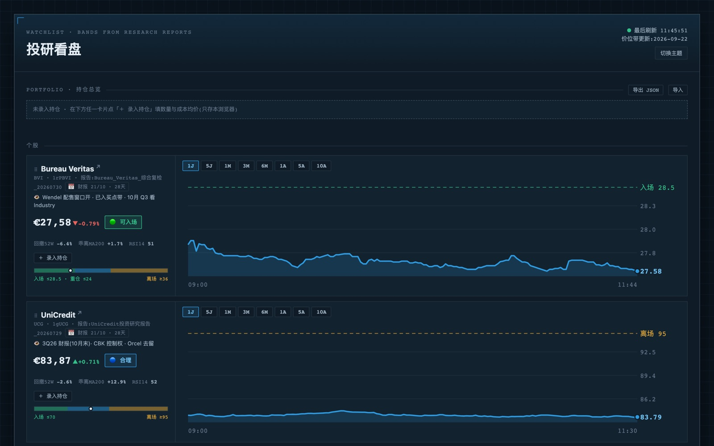

# invest-dashboard

[English](README.md)

个人看盘页。实时行情按我自己研究报告给出的价位带着色,一眼看出某个标的在入场区、合理区还是触发了离场信号。姊妹项目:[etf-ai-analyst](https://github.com/yuuteng/etf-ai-analyst)。

线上地址:https://invest-dashboard-snowy.vercel.app/



## 页面内容

- 行情来自 Boursorama(巴黎股实时),失败时 Yahoo 补位,延迟或过期的值有角标。
- 每个标的落在自己的价位带上:🟢 低于入场价、🔵 合理、🟡 偏高、🔴 已触发离场信号。
- 每行可展开 Boursorama 同款走势图(1 日到 10 年),长窗口叠加滚动 MA200。
- 每个标的的技术指标:距 52 周最高、相对 MA200 乖离、RSI(14)。
- 个股有财报日角标,两周内变黄,过期变红。
- 持仓面板算浮动盈亏和当日盈亏。数量和成本只存在浏览器 localStorage,可以导出 JSON。

## 结构

| 路径 | 作用 |
|------|------|
| `index.html` | 全部 UI。每 15 秒轮询 `/api/quotes`,价位带读 `bands.json` |
| `bands.json` | 数据:标的池、入场和离场阈值、观察哨、报告名、下次财报日 |
| `api/quotes.js` | Vercel 函数。服务端抓 Boursorama 报价页,失败走 Yahoo,CDN 缓存 15 秒 |
| `api/history.js` | 走势图用的历史序列(分钟线和日线) |
| `api/indicators.js` | 日线指标:52 周最高、MA200、RSI(14),CDN 缓存 1 小时 |
| `scripts/dev_server.js` | 本地服务,模拟 Vercel 路由 |

## 部署

在 Vercel 导入仓库,框架选 Other。推到 `main` 即自动部署。

## 更新价位带

研究报告刷新后,改 `bands.json` 里对应标的的 `green`、`strong`、`yellow`、`axis`、`watch`、`report`、`earnings`,更新 `updated` 日期,commit 并 push。带为 `null` 时只显示价格不着色。

## 本地运行

```sh
node scripts/dev_server.js
```

打开 <http://localhost:8899/> 即可。

## 免责声明

仅供研究和学习,不构成投资建议。行情可能延迟,价位带反映的是我在所注日期的个人研究。
